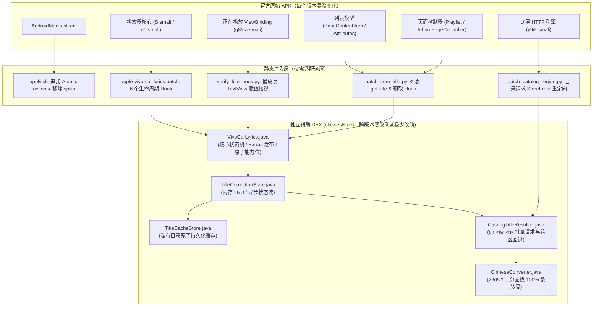
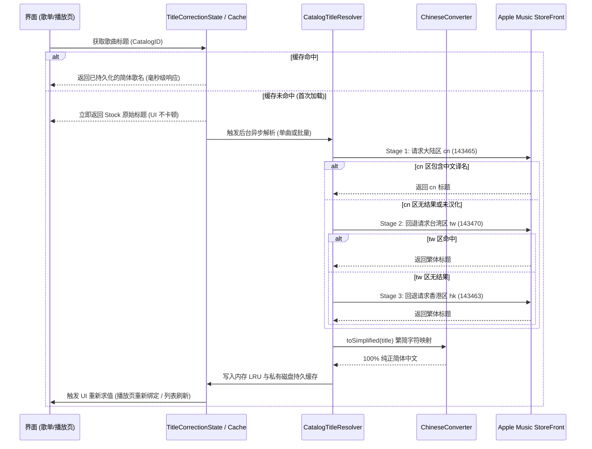
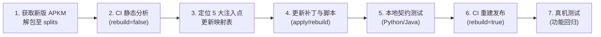

# Apple Music 新版本 APK 适配与升级指南 (Future Upgrade Guide)

> **适用场景**：当 Apple Music 官方发布新版本（如 Android 7.0+ 正式版或后续更新）时，指导开发者/AI 快速定位变更、移植车机歌词、原子随身听播控/歌词/进度条，以及全界面独立歌名汉化（含多区回退与繁简转换）的完整实操手册。
>
> **当前验证基准**：Apple Music 7.0.0-beta (versionCode: 1607)，CI Build #155 (Release `v1.0.0-build-155`) 已全绿通过并在 Samsung Galaxy Tab S7 实机部署验证。

---

## 1. 架构核心与设计原则

本项目采用**纯净轻量、独立解耦**的架构设计，完全摆脱对任何第三方 Hook 框架（如 Xposed / LSPosed / NPatch / AM++）的依赖：



### 1.1 为什么升级极其轻松？
- **Helper 逻辑独立存在于末尾 DEX**：所有 Java 源码（`VivoCarLyrics`, `CatalogTitleResolver`, `ChineseConverter`, `TitleCacheStore`, `TitleCorrectionState`）在构建时被独立编译为 `classesN.dex` 追加到 APK 末尾。
- **业务代码跨版本复用率 > 90%**：繁简转换算法、多区 StoreFront 批量回退链、持久缓存机制、原子随身听状态机均为纯 Java/Android 框架代码，**新版 APK 发布时完全无需重写这些核心逻辑**。
- **升级工作仅集中在“5 个关键注入点”**：新版 APK 只需要重新定位官方混淆后的 5 个注入点，并生成对应的 Smali 钩子即可完成全量适配。

---

## 2. 必须适配的 5 个关键注入点

在官方推出新版 APK（如 7.1 或 7.0 正式版）时，由于 ProGuard / R8 混淆，类名和方法名通常会变动。以下是必须重新定位的 5 大注入点：

---

### 注入点 1：`AndroidManifest.xml`（原子随身听协作声明与去 Split 化）
* **目的**：
  1. 向 `MediaPlaybackService` 声明 `com.vivo.musicwidgetmix.support.service`，确保原子随身听加载“合作控制器（`c0`）”，处理整首 LRC 与时间轴。
  2. 移除 APKM 解包后残留的 Split 分包属性（`isSplitRequired`、`requiredSplitTypes` 及对应 `meta-data`），使 APK 变成合法的 Android Standalone 单包，防止出现 `-28` 安装错误。
* **脚本位置**：`cloud-patch/apply.sh`（内部内置 Python XML 解析器，自动处理）。
* **新版本排查要点**：
  - 确认服务名仍为 `com.apple.android.music.player.MediaPlaybackService`。
  - 确认该服务包含 `android.media.browse.MediaBrowserService` 的 `intent-filter` 并且 `android:exported="true"`。

---

### 注入点 2：播放器核心与生命周期 Hook（6 个歌词/播控钩子）
* **涉及文件**：`cloud-patch/apple-vivo-car-lyrics.patch`
* **宿主类特征（1607 中为 `S.smali` 与 `e0.smali`）**：
  - **播放管理器（1607: `S.smali`）**：实现了 `MediaPlayerController.Listener`（包含 `onCurrentItemChanged`、`onMetadataUpdated`、`onPlaybackError`），并持有调用 `seekToPosition(long)` 的 `seekTo(J)` 方法。
  - **MediaSession 回调类（1607: `e0.smali`）**：继承自 Media3 `MediaSession.Callback`，包含 `onPostConnect`（1607 中混淆为 `o(LJ4/f2;LJ4/f2$e;)V`）。
* **6 个 Hook 语义与调用说明**：
  1. `VivoCarLyrics.onNativeMediaItem(Object mediaItem)`:
     - **位置**：官方原生发布 MediaItem 的方法（1607 为 `S.P(Lz3/v;I)V`）内，在参数判断（`if-nez p2`）之后、`hashCode()` 之前。
     - **作用**：原位向 MediaItem 的 `extras` 写入原子随身听能力位 `7 | 8 | 16 = 31`。
  2. `VivoCarLyrics.onCurrentItemChanged(Object manager, Object newQueueItem)`:
     - **位置**：`onCurrentItemChanged` 回调入口，空检查后。
     - **作用**：换歌事件，重置歌词状态、发空歌词事件清空原子随身听上一首缓存。
  3. `VivoCarLyrics.onMetadataUpdated(Object manager, Object queueItem)`:
     - **位置**：`onMetadataUpdated` 回调入口。
     - **作用**：元数据变更时重新加载歌词。
  4. `VivoCarLyrics.onPlaybackError(Object manager)`:
     - **位置**：`onPlaybackError` 回调入口。
     - **作用**：清空歌词，派发错误状态。
  5. `VivoCarLyrics.onSeek(Object manager, long targetPositionMs)`:
     - **位置**：`seekTo(J)` 方法中，紧跟 `invoke-interface ... seekToPosition(J)` 之后。
     - **作用**：进度拖动时立即计算并跳转对应歌词行。
  6. `VivoCarLyrics.onAtomicControllerConnected(String controllerPackageName)`:
     - **位置**：`onPostConnect` 内部，从 `ControllerInfo` 获取包名处。
     - **作用**：当连接者为 `com.vivo.musicwidgetmix` 时，短延迟补发当前歌词与进度状态。

---

### 注入点 3：正在播放界面标题 UI Hook（ViewBinding 接缝）
* **目的**：正在播放全屏界面的歌名 TextView 不走普通列表 Adapter，而是通过 ViewBinding 直接渲染。需要拦截其 `getTitle()` 并替换为已汉化的标题。
* **涉及文件**：`cloud-patch/verify_title_hook.py`（负责前后接缝验证）与 `apple-vivo-car-lyrics.patch`。
* **宿主类特征（1607: `q8/na.smali` 方法 `l()V`）**：
  - 该类是当前播放界面的 ViewBinding 逻辑持有类。
  - 搜索特征：调用 `CollectionItemView->getTitle()Ljava/lang/String;`，随后将结果赋给 `CustomTextView`。
* **注入代码**：
  ```smali
  invoke-static/range {v39 .. v41}, Lcom/apple/android/music/player/VivoCarLyrics;->correctPlayerTitle(Ljava/lang/Object;Ljava/lang/Object;Ljava/lang/CharSequence;)Ljava/lang/CharSequence;
  move-result-object v39
  ```
* **注意**：保持原始 `.locals`（1607 为 58）不变，复用已确认失活的空闲寄存器。

---

### 注入点 4：全界面歌名汉化与歌单预取 Hook（列表/专辑/控制器）
* **目的**：实现歌单列表、专辑详情页、资料库全部显示简体中文，且在歌单或专辑滑入视图时自动批量预取汉化歌名。
* **涉及文件**：`cloud-patch/patch_item_title.py`
* **宿主类与方法特征（在官方未混淆的业务架构中，极其稳定）**：
  1. `com/apple/android/music/model/BaseContentItem.smali`:
     - 方法：`getTitle()Ljava/lang/String;`
     - 注入：调用 `VivoCarLyrics.resolveItemTitle(p0, v0)`。覆盖绝大多数列表模型展示。
  2. `com/apple/android/music/mediaapi/models/internals/Attributes.smali`:
     - 方法：`getName()Ljava/lang/String;`
     - 注入：调用 `VivoCarLyrics.resolveItemTitle(p0, v0)` 并原位 `iput-object` 赋回 `name`。
  3. `com/apple/android/music/collection/mediaapi/controller/PlaylistPageController.smali`:
     - 方法：`addTrackModel(MediaEntity;I)Lcom/airbnb/epoxy/w;`
     - 注入：调用 `VivoCarLyrics.onPlaylistTrack(p0, p1)`，实现歌单批量预取。
  4. `com/apple/android/music/collection/mediaapi/controller/AlbumPageController.smali`:
     - 方法：`getItemTitle(MediaEntity;)Ljava/lang/String;`
     - 注入：调用 `VivoCarLyrics.onPlaylistTrack(p0, p1)`，实现专辑批量预取。
* **脚本执行**：
  - `python3 cloud-patch/patch_item_title.py work/apktool --apply`

---

### 注入点 5：Catalog 目录网络请求拦截与 StoreFront 注入
* **目的**：将我们发起的汉化歌名查询定向到 Apple Music 的 StoreFront API，并具备注入语言、地区、请求头的能力。
* **涉及文件**：`cloud-patch/patch_catalog_region.py`
* **宿主类特征（1607: `y9/k.smali`）**：
  - 负责 Apple Music 底层 RESTful API 请求发送的单例类（包含 URL、参数、Headers 组装）。
  - 方法签名（1607 为 `a(Ljava/lang/String;Ljava/lang/String;ZLjava/util/LinkedHashMap;Ljava/util/Map;Lkk/C;Lhi/c;)Ljava/lang/Object;`）。
* **注入代码**：
  ```smali
  invoke-static {p1, p4, p5}, Lcom/apple/android/music/player/CatalogTitleResolver;->correctCatalogRequest(Ljava/lang/String;Ljava/util/LinkedHashMap;Ljava/util/Map;)Ljava/lang/String;
  move-result-object p1
  ```
* **行为保证**：
  - 仅拦截我们模块发出的请求（通过唯一的请求 token 标识），普通用户的账号请求、播放流鉴权、歌词下载请求**绝不拦截**，保证原生账号与流媒体安全。

---

## 3. 多区回退与繁简转换引擎设计

我们集成的 `CatalogTitleResolver` 与 `ChineseConverter` 解决了两个最核心的中文显示痛点：
1. **中文歌名跨区缺失**（例如某些歌曲大陆区下架或未提供官方中文译名，但在港台区有中文译名，如《我怎么哭了》等）。
2. **繁体与异体字体验不佳**（港台区返回繁体“我怎麼哭了”，需要统一转换为标准的 100% 简体中文）。



### 3.1 三级 StoreFront 回退链
- **第一级**：中国大陆 StoreFront `cn`（StoreFront ID: `143465`，语言 `zh-CN`, `zh-Hans`）。
- **第二级**：中国台湾 StoreFront `tw`（StoreFront ID: `143470`，语言 `zh-TW`）。
- **第三级**：中国香港 StoreFront `hk`（StoreFront ID: `143463`，语言 `zh-HK`）。

### 3.2 高性能内存二分查找繁简转换器 (`ChineseConverter.java`)
- 内置 **2965 个高频 BMP 繁简对应字符**，字符数组经过精确 Unicode 升序排序。
- 采用二分查找（Binary Search），查找复杂度为 $O(\log N)$。
- **零额外堆内存分配**：纯基本类型数组，不依赖任何第三方臃肿库（如外部 OpenCC jar 或 so 文件），极度节省 Android 内存。

---

## 4. 新版本升级实操全流程（逐步执行手册）

当拿到新版 Apple Music APKM 时，按以下 7 个步骤推进：



### 步骤 1：解包 APKM 并更新 payload
1. 解压下载的 `.apkm` 文件，提取 `base.apk` 与所有的 `split_config.*.apk`。
2. 放入 `payload.tar/input/splits/` 目录。
3. 重新切片并计算 SHA-256：
   ```bash
   ( cd /tmp/payload && tar -cf /tmp/payload.tar . )
   split -b 20m -d -a 3 /tmp/payload.tar payload.tar.part.
   shasum -a 256 /tmp/payload.tar | sed 's#  .*#  payload.tar#' > payload.sha256
   ```
4. 记录新版本号并更新 `.github/workflows/apk-pipeline.yml` 中的 `APK_NAME`。

### 步骤 2：触发 CI 静态分析
提交切片并触发只分析工作流（本地不需要安装 apktool/jadx）：
```bash
git push origin <branch>
gh workflow run "APK analysis and rebuild" --ref <branch> -f rebuild=false
gh run watch <run-id>
gh run download <run-id> -n apk-results-<run>-report -D /tmp/report
```
解压下载报告中的 `focused-sources.tar.gz`，获得新版反编译后的 Smali 与 Java 源码。

### 步骤 3：重新定位 5 个注入点
在反编译产物中重新查找并核对：
1. **播放管理器**：grep `seekToPosition` 或 `onCurrentItemChanged`，确认新类名（如 `S.smali` 是否变成了其他字母）。
2. **MediaItem 发布入口**：检查原生 `P(Lz3/v;I)V` 方法名与参数类型是否变动。
3. **MediaSession 连接回调**：grep `ControllerInfo` 或 `onPostConnect`，确认连接方法签名。
4. **ViewBinding 标题 Hook**：grep `CollectionItemView` 与 `getTitle`，定位新的 `na.smali` 等价类。
5. **HTTP 客户端类**：grep `/v1/catalog/` 或底层网络分发方法，定位新的 `y9/k.smali`。
6. **未混淆列表类**：确认 `BaseContentItem`、`Attributes`、`PlaylistPageController`、`AlbumPageController` 类路径是否未变（通常跨大版本都不变）。

### 步骤 4：更新补丁文件与适配脚本
1. **更新 Smali 补丁**：根据新类名更新 `cloud-patch/apple-vivo-car-lyrics.patch`。
2. **更新校验脚本**：
   - 修改 `cloud-patch/apply.sh` 中的 `manager_target`、`connection_target` 及方法签名。
   - 修改 `cloud-patch/verify_title_hook.py` 中的 `TARGET`、`METHOD` 及上下文指令。
   - 修改 `cloud-patch/patch_catalog_region.py` 中的 `TARGET`、`METHOD` 与 SHA256。
   - 若 `patch_item_title.py` 中的类名有变动，同步更新类名常量。
3. **更新辅助类（必要时）**：
   - 若 MediaItem / PlaybackItem 反射字段有变（如字段 `J` 变更为其他名字），在 `cloud-patch/java/com/apple/android/music/player/VivoCarLyrics.java` 中增加新字段 fallback。

### 步骤 5：本地自动化离线测试
在本地运行静态契约测试与状态机单元测试，保证未破坏任何基线：
```bash
# 验证源码契约（禁止重发 MediaItem、能力位包含 7|8|16）
python cloud-patch/tests/verify_source_contract.py

# 验证核心 Python 契约与回退状态测试
python cloud-patch/tests/test_p0_classes.py
```
全部显示 `PASSED` / `OK` 即可提交。

### 步骤 6：CI 构建与全量发布
提交代码并触发全量重建：
```bash
git push origin <branch>
gh workflow run "APK analysis and rebuild" --ref <branch> \
  -f rebuild=true -f embed_ampp=false -f standalone_module=false
```
CI 构建成功后，会自动创建 GitHub Release `v1.0.0-build-<run_number>`，包含重新签名的 APK 及 SHA-256 校验文件。

### 步骤 7：真机部署与功能回归验证
下载 APK 并安装到测试机（例如平板或手机）：
```bash
adb install -r <rebuilt-apple-music>.apk
```
**回归验证清单**：
- [ ] 1. 播放任意普通歌曲，声音正常，无损/杜比全景声生效。
- [ ] 2. 进入歌单列表，歌名批量呈现简体中文。
- [ ] 3. 进入专辑详情页，全部曲目呈现简体中文。
- [ ] 4. 播放曾出现英文原名或港台繁体的歌曲（如五月天/831歌曲），确认显示为 100% 简体中文。
- [ ] 5. 正在播放界面歌名正确显示简体中文。
- [ ] 6. 切歌时，旧曲名立即刷新，无串歌名残留。
- [ ] 7. 连接 vivo JoviInCar 车机：车机中控屏歌词正常同步滚动，切句时不刷新封面。
- [ ] 8. vivo 原子随身听：桌面小组件歌词同步显示，进度条正常显示时长、随播放走动、支持拖拽 seek。

---

## 5. 核心避坑指南与铁律

| 踩坑点 | 现象 / 后果 | 预防铁律 |
|---|---|---|
| **重发 MediaItem** | 原子随身听进度条丢失变 `--:--`，车机每句歌词封面狂闪 | **铁律**：`publishMetadata` 必须保持无操作（no-op）。只允许更新 MediaSession Extras，严禁调用原生 `publish` 方法重新推送 MediaItem。 |
| **原子能力位遗漏** | 原子随身听有歌词但进度条永远显示 `--:--` | **铁律**：在原生 MediaItem extras 发布路径中必须**原位 OR 入** `7 \| 8 \| 16 = 31`。其中 `16` 代表 seek/time 进度条能力位，不可遗漏。 |
| **macOS 大小写不敏感** | 解压 Smali 时 `na.smali` 与 `Na.smali` 相互覆盖 | **铁律**：在 macOS 解包时使用 `tar -xOzf` 查看指定流，或在 GitHub Actions Linux 环境下解包，避免文件名覆盖混淆。 |
| **网络请求全局污染** | 导致官方用户账号封禁、换区失败或播放鉴权异常 | **铁律**：StoreFront 目录请求必须携带模块专用请求 token，只有被标记的歌名请求才走大陆/港台 StoreFront，原生账号流请求原样直通。 |
| **异步更新非原子** | 快速切歌时上一首的异步结果落到新歌上 | **铁律**：所有异步标题回填必须比对 `generation`、`queueId`、`catalogId`。如果当前播放歌曲已变更，异步结果仅写入持久化磁盘缓存，绝不刷新到当前 UI。 |
| **繁体字转换性能** | 转换大歌单时 UI 掉帧、卡顿 | **铁律**：`ChineseConverter` 采用预排序二分查找与局部替换，严禁在主线程频繁分配大对象或正则匹配。 |

---

## 6. 核心文件职责索引

- `cloud-patch/java/com/apple/android/music/player/VivoCarLyrics.java`：总状态机，负责车机与原子随身听歌词分发、播放器生命周期拦截、原子能力位原位注入、UI 标题调度。
- `cloud-patch/java/com/apple/android/music/player/CatalogTitleResolver.java`：StoreFront 多区网络解析器，管理 `cn` $\to$ `tw` $\to$ `hk` 级联回退与批量 Stage 调度。
- `cloud-patch/java/com/apple/android/music/player/ChineseConverter.java`：高性能纯 Java 繁简转换引擎，2965 个字符二分查找。
- `cloud-patch/java/com/apple/android/music/player/TitleCorrectionState.java`：内存 LRU 缓存与异步解析并发状态管理。
- `cloud-patch/java/com/apple/android/music/player/TitleCacheStore.java`：应用私有目录的轻量原子文件持久化缓存（容量 256 项，30 天过期）。
- `cloud-patch/patch_item_title.py`：列表模型与 Epoxy 页面控制器的静态/动态 Smali 注入脚本。
- `cloud-patch/patch_catalog_region.py`：底层 HTTP 客户端 Smali 注入脚本。
- `cloud-patch/verify_title_hook.py`：正在播放界面 ViewBinding 赋值接缝静态断言工具。
- `cloud-patch/apply.sh`：主注入驱动脚本（打 patch、修改 manifest、运行 python 注入脚本、签名校验）。
- `cloud-patch/rebuild.sh`：主重建驱动脚本（apktool 回编译、编译 Java helper 为 classesN.dex、zipalign、签名）。
- `cloud-patch/tests/verify_source_contract.py`：代码安全契约断言测试。
- `cloud-patch/tests/test_p0_classes.py`：Python 单元与回退测试集。
